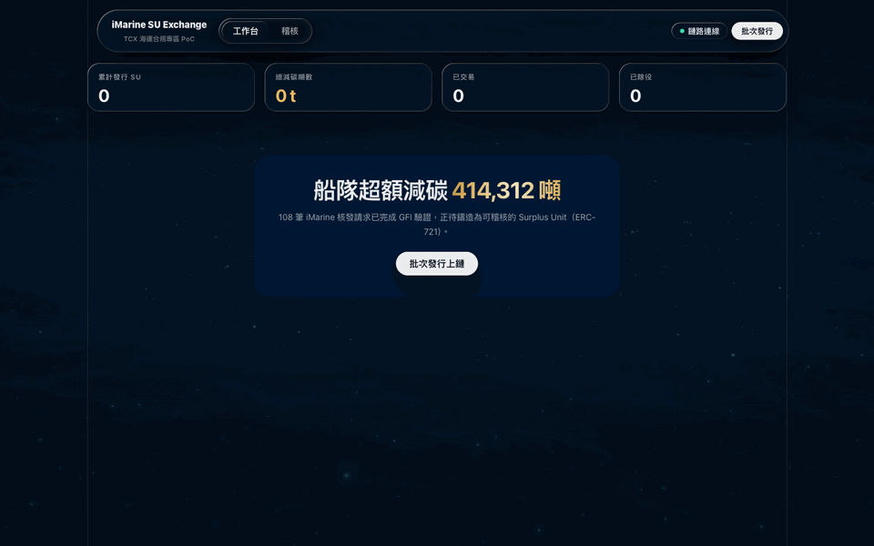
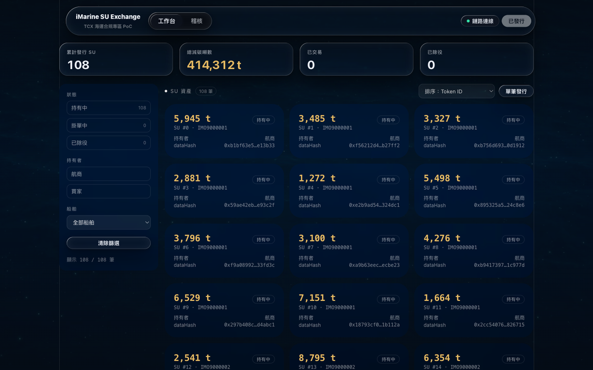
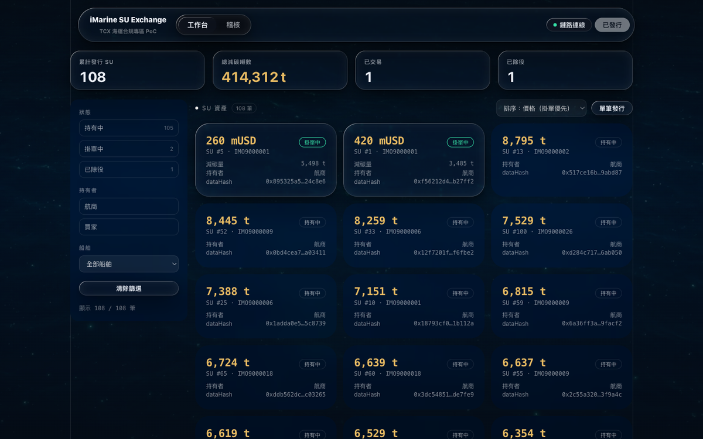
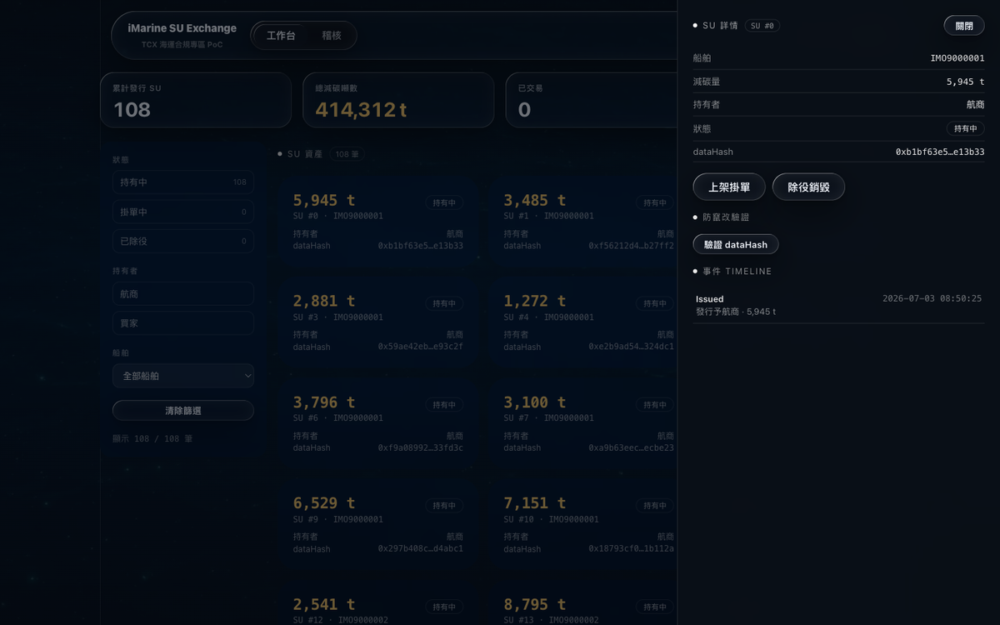
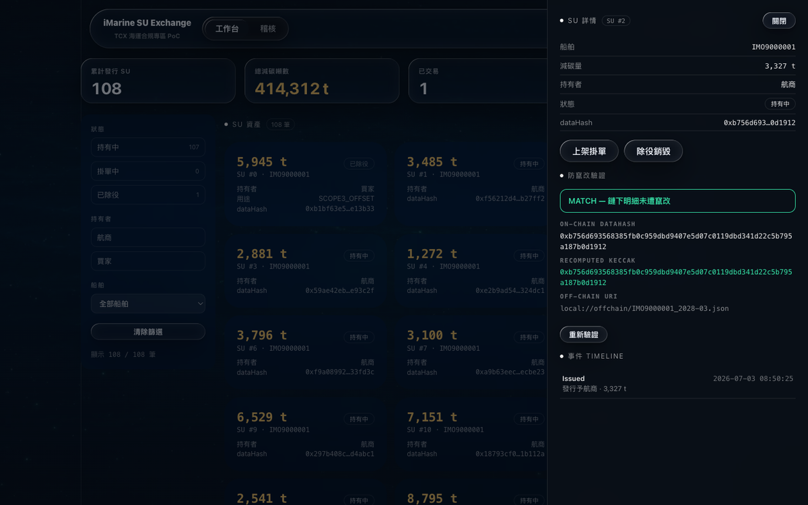
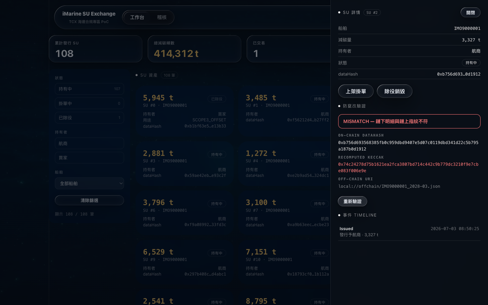
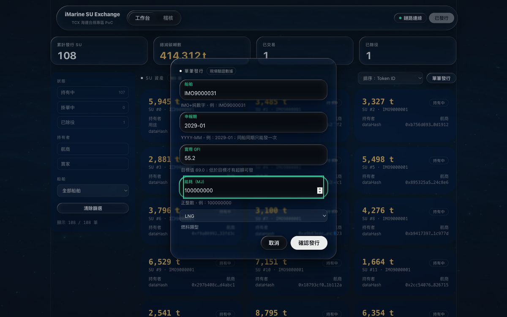
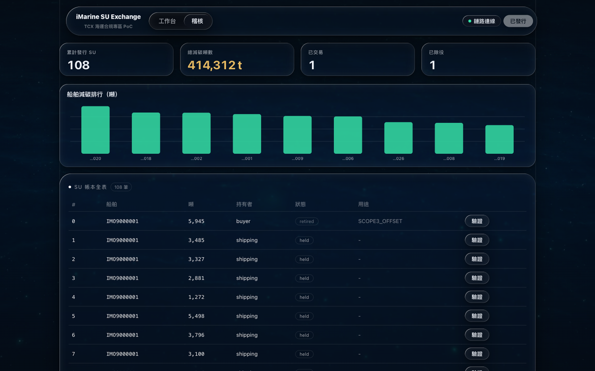

# iMarine · 港口碳權代幣化 PoC

> 2026 航港大數據創意應用競賽參賽作品

把船舶超額減碳（Surplus Unit, SU）鑄成鏈上代幣，可掛單交易一次、可為特定用途除役銷毀，全程留下可稽核事件。這是 **TCX 海運合規專區藍圖裡「未來 RWA 層」的可運作雛形**——從鏈到 UI 都能實際跑起來。



> 上圖為實機操作：批次發行 108 張 SU → 開詳情側欄上架掛單 → 以買家身分購買（唯一一次合法轉讓）→ 為 Scope 3 用途除役銷毀 → 稽核頁留下 Issued / Listed / Sold / Retired 四筆鏈上事件。

---

## 系統畫面

**工作台**——常駐統計帶 + 左側篩選欄（狀態 / 持有者 / 船舶）+ SU 卡片格；發行前顯示引導卡。



**市場**——掛單中的 SU 以折射玻璃卡浮現、價格（金）最大、狀態 pill（綠）標記；其餘持有中的資產為磨砂卡。排序可切「價格（掛單優先）」。



**SU 詳情側欄**——點任一卡片右側滑出：資產明細、就地動作（上架 / 購買 / 除役，依狀態與角色顯示）、該 token 的事件 timeline，以及防竄改驗證。



**防竄改驗證（口試亮點）**——側欄一鍵回驗：讀鏈上 `dataHash`、對鏈下明細重算 keccak 比對。左為未遭竄改（MATCH，綠）；右為竄改鏈下明細後（MISMATCH，紅，重算雜湊與鏈上指紋不符）。

| 未竄改 · MATCH | 遭竄改 · MISMATCH |
|---|---|
|  |  |

**單筆自訂發行**——現場輸入一筆船舶驗證數據（船舶 / 申報期 / 實際 GFI / 能耗 / 燃料），系統以與批次相同的公式算超額噸數、產鏈下明細 + `dataHash`、鑄一張新 SU。實際 GFI ≥ 目標值（缺額）或同船同期重複，皆會被拒發。



**稽核**——船舶減碳排行 + SU 帳本全表 + 事件表（Issued / Listed / Sold / Retired 可點篩選）。



---

## 專案定位

台灣不是 IMO 會員國，卻躲不掉國際碳定價與供應鏈（Scope 3）的減碳要求。本專案示範一條可行路徑：由航港局主導，將經第三方驗證的船舶超額減碳登錄、上鏈、並支援 book-and-claim 式的碳權移轉。目標不是產品，而是一個「私鑰複製下來就能在 VS Code 從鏈到 UI 跑起來」的可展示雛形。

## 核心概念

以 **Surplus Unit (SU)** 為核心資產，四個動作 + 兩個限制：

- **發行 (mint)**：由核發者依驗證後的超額減碳量鑄造，附帶鏈下明細的雜湊（`dataHash`）防竄改。
- **交易 (list / buy)**：於市場合約掛單，付款與代幣移轉在同一筆交易原子交割。
- **除役 (retire)**：持有者為特定用途（如 Scope 3 抵減）銷毀代幣並留下用途標籤。
- **限制**：每單位**只能真正轉讓一次**、且**逾期不可轉讓**——貼近碳權「用一次就消耗」的性質。

`Purpose` 四種用途：`NZF_REWARD`（淨零基金獎勵）、`EU_ETS_OFFSET`（歐盟碳交易抵換）、`PORT_FEE_REBATE`（港埠費率回饋）、`SCOPE3_OFFSET`（Scope 3 抵換）。

## 系統架構

四層、層間以明確介面解耦，任一層可獨立替換：

```
UI 層          單一 HTML + 原生 JS，只消費後端 REST（工作台 / 稽核雙分頁）
  ↓ REST
後端/媒介層     web3.py + FastAPI：送交易 / 聽事件 / 管金鑰 / 開 API
  ↑ 讀
資料介面層      能耗資料 → 碳強度(GFI)/超額量計算 → 驗證 → 標準化鑄造請求 + dataHash
  ↑ 讀
鏈層           Solidity + Hardhat：SurplusUnit(ERC-721) / Market / MockStablecoin
```

**唯二的層間介面**——要遷移或擴充只動介面，不必上下游全改：

1. **鏈層 → 後端**：`shared/contracts.<network>.json`（地址 + ABI + 角色帳號），由部署腳本自動產生，後端只讀。
2. **資料層 → 後端**：標準化的鑄造請求 JSON（固定 schema），後端只認 schema、不管資料怎麼算出來。

換鏈只改 `.env`；換資料源只加一個 `data/sources/*.py` adapter。設計圍繞三個原則：**可遷移**（環境相關設定集中、程式碼不寫死）、**可擴展**（抽象介面與角色控制，加功能只加不改）、**可維護**（單一職責、單一設定入口、測試先行）。

## 技術棧

| 層 | 技術 |
|---|---|
| 鏈層 | Solidity 0.8.24、Hardhat 2.x、OpenZeppelin Contracts v5（ERC-721 用 `_update` 攔截轉讓）|
| 資料層 | Python 3.11+、pandas、web3.py（keccak）|
| 後端 | Python、web3.py、FastAPI |
| UI | 原生 HTML + JavaScript（零建置、零框架；深色電影感 + Liquid Glass）|

## 快速開始

需求：Node.js LTS ≥ 20、**Python ≥ 3.11**（若系統 `python3` 較舊，用 pyenv 等建一個 3.11+ 的 venv）。

```bash
# 1) 安裝相依
npm install
python3 -m venv .venv && source .venv/bin/activate && pip install -r requirements.txt
cp .env.example .env                 # 本地測試金鑰已在範本內（僅限本地）

# 2) 產生執行期產物（介面檔都是 gitignore、需自行產生）
make chain                           # 終端機 A（會佔用）：啟動本地 Hardhat 鏈
make deploy                          # 終端機 B：部署三合約 + 匯出 shared/contracts.localhost.json
make data                            # 產出 data/out/minting_requests.json（108 筆 / 414,312 噸）

# 3) 開後端與 UI
make api                             # FastAPI（:8000），API 文件 http://127.0.0.1:8000/docs
make ui                              # UI（:5500），瀏覽 http://127.0.0.1:5500
```

> 想不開 UI、只看整條流程：`make demo` 會印出某 SU 的 `held → listed → sold → retired` 全程。
> 一鍵指令對照見 `Makefile`（`make test` 跑合約單元測試、`make test-backend` 跑後端整合測試）。

## 目前進度

四層 + UI 全部完成，逐層通過測試、合併前經多角度審查：

- **鏈層（智能合約）— 完成。** SU 的鏈上規則全部寫好、單元測試 **5/5 全綠**：發行、只能真正轉手一次、到期失效、除役銷毀、市場「一手交錢一手交券」的原子交割。
- **資料層（資料處理）— 完成。** 把船舶能耗換算成「超額減碳噸數」，只有真的超額的船才發券，並替每筆產生防竄改指紋（`dataHash`）。示範資料（30 艘船 × 12 個月）跑出 **108 張可鑄券、合計 414,312 噸**。
- **後端 — 完成。** 串起上面兩層並對外開 REST API：批次發行、單筆自訂發行、上架、購買、除役全流程可跑，本地帳本從鏈上事件同步，`/verify` 端點回驗鏈上指紋與鏈下明細一致。整合測試 + 資料層單元測試通過。
- **UI — 完成。** 「工作台 + 稽核」雙分頁：常駐統計帶、篩選欄 + 卡片格、SU 詳情側欄（就地交易 + 事件 timeline + 防竄改驗證）、稽核事件表。單一 HTML + 原生 JS，只打後端 REST。

## 目錄結構

```
contracts/   鏈層合約（SurplusUnit / Market / MockStablecoin）
test/        合約單元測試
scripts/     部署腳本
shared/      鏈層 → 後端的介面檔（部署後自動產生）
data/        資料介面層（資料來源 adapter、計算、驗證、鑄造請求）
backend/     後端媒介層（chain client、本地帳本、服務、API）
ui/          流程觀察前端（工作台 / 稽核）
assets/      README 用截圖與動畫
```

## 授權

待定（合約程式碼採 MIT，見各 `.sol` 檔 SPDX 標頭）。
